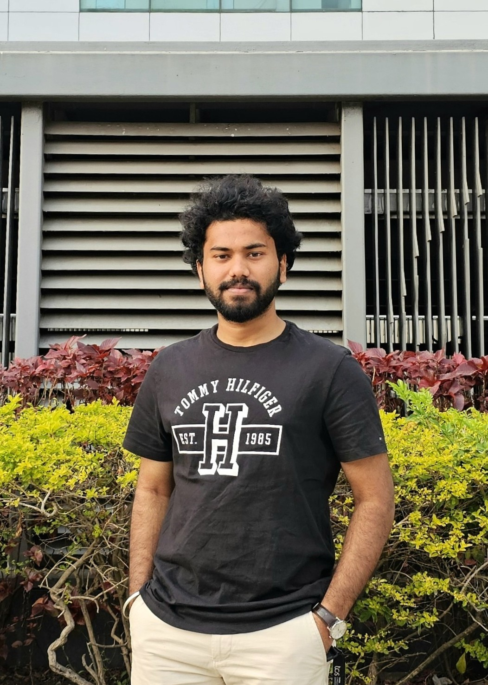

# Sai Sujith Kandagatla — Portfolio

This is a simple, static portfolio website for **Sai Sujith Kandagatla**, showcasing backend engineering experience, projects, and strong **Data Structures & Algorithms** practice.

## Structure

- `index.html` — main single-page portfolio
- `styles.css` — layout, typography, and light/dark theme styling
- `script.js` — year auto-update and theme toggle

## Running the site

Because this is a static site, you can:

- Open `index.html` directly in your browser, or
- Serve it with any static file server (for example, GitHub Pages, Netlify, or `npx serve`).

## Adding your images

1. Create an `assets` folder next to `index.html` (if it does not already exist).
2. Place your profile photo inside it, e.g. `assets/profile.jpg`.
3. If the filename or path is different, update the `src` in `index.html`:

   ```html
   
   ```

You can repeat this process for any additional images you want to use.

## Customization tips

- Update any text in `index.html` if your role, stats (e.g. number of problems solved), or links change.
- Adjust colors, spacing, or layout in `styles.css`.
- Extend `script.js` with more interactivity if needed (animations, analytics hooks, etc.).

